# MT-CSAMT

一维层状模型大地电磁测深 (MT) 和可控源音频大地电磁测深 (CSAMT) 正演计算

## 开源协议

[MIT 协议](http://tchel.mit-license.org/)

## 联系作者

TcheL, seistche@gmail.com, USTC

## 正演理论

### 大地电磁测深

根据（朱仁学，2003），在一维情况下，$ N $ 层模型的地表阻抗可由下式计算：

$$ Z_N(0) = \frac{\omega \mu_0}{k_1} R_N(0) = Z_{01} R_N(0) $$

$$ R_N(0) = \coth \left\lbrace - i k_1 h_1 + \coth^{ - 1} \left[ \frac{k_1}{k_2} \cdot \coth \left( - i k_2 h_2 + \coth^{ - 1} \left[ \frac{k_2}{k_3} \cdot \coth \left( - i k_3 h_3 + \cdots + \coth^{ - 1} \frac{k_{N - 1}}{k_N} \right) \right] \right) \right] \right\rbrace $$

其中 $ \omega $ 为角频率，$ \mu_0 = 4 \pi \times 10^{ - 7} H/m $ 为空气中的磁导率，$ k_j = \sqrt{ i \omega \mu_0 / \rho_j } $ 为第 j 层的传播常数（或称波数），$ \rho_j $ 为第 j 层的电阻率，$ h_j $ 为第 j 层的厚度。上式仅适用于 $ k_{N - 1} / k_N > 1 $ 的情况；当 $ k_{N - 1} / k_N < 1 $ 时，应采用双曲正切形式的计算公式。

则视电阻率可表示为：

$$ \rho_a = \frac{ |Z_{01}|^2 \cdot |R_N(0)|^2 }{\omega \mu_0} = \rho_1 \cdot |R_N(0)|^2 ​$$

阻抗相位可表示为：

$$ \theta = \tan^{ - 1} \frac{ \Im [ Z_N(0) ] }{ \Re [ Z_N(0) ] } $$

波长定义为：

$$ \lambda_j = \frac{2\pi}{\sqrt{\omega \mu / (2 \rho_j)}} = 10^3 \cdot \sqrt{10 \rho_j / f} $$

### 可控源音频大地电磁测深

根据（付海涛 等，2019）及（张健，2011），$ N $ 层水平层状介质表面上水平电偶极子产生的电磁场各分量的表达式为：

$$ E_r = \frac{ I \text{dL} }{2\pi} \cos\phi \left[ \frac{ i \omega \mu }{r} \int_0^\infty \frac{1}{ \lambda + m_1/R^* } J_1(\lambda r) d\lambda - \rho_1 \int_0^\infty \frac{\lambda m_1}{R} J_0(\lambda r) d\lambda + \frac{\rho_1}{r} \int_0^\infty \frac{m_1}{R} J_1(\lambda r) d\lambda \right] ​$$

$$ E_\phi = \frac{ I \text{dL} }{2\pi} \sin\phi \left[ \frac{\rho_1}{r} \int_0^\infty \frac{m_1}{R} J_1(\lambda r) d\lambda - i \omega \mu \int_0^\infty \frac{\lambda}{\lambda + m_1/R^*} J_0(\lambda r) d\lambda + \frac{ i \omega \mu }{r} \int_0^\infty \frac{1}{\lambda + m_1/R^*} J_1(\lambda r) d\lambda \right] ​$$

$$ H_r = - \frac{ I \text{dL} }{ 2 \pi r } \sin\phi \left[ \int_0^\infty \frac{\lambda}{\lambda + m_1/R^*} J_1(\lambda r) d\lambda + r \int_0^\infty \frac{m_1}{R^*} \frac{\lambda}{\lambda + m_1/R^*} J_0(\lambda r) d\lambda \right] ​$$

$$ H_\phi = \frac{ I \text{dL} }{ 2 \pi r } \cos\phi \int_0^\infty \frac{\lambda}{\lambda + m_1/R^*} J_1(\lambda r) d\lambda $$

$$ H_z = \frac{ I \text{dL} }{2\pi} \sin\phi \int_0^\infty \frac{\lambda^2}{\lambda + m_1/R^*} J_1(\lambda r) d\lambda $$

$$ R^* = \coth \left \lbrace m_1 d_1 + \coth^{ - 1} \left[ \frac{m_1}{m_2} \cdot \coth \left( m_2 d_2 + \coth^{ - 1} \left[ \frac{m_2}{m_3} \cdot \coth \left( m_3 d_3 + \cdots + \coth^{ - 1} \frac{m_{N - 1}}{m_N} \right) \right] \right) \right] \right \rbrace $$

$$ R = \coth \left \lbrace m_1 d_1 + \coth^{ - 1} \left[ \frac{m_1 \rho_1}{m_2 \rho_2} \cdot \coth \left( m_2 d_2 + \coth^{ - 1} \left[ \frac{m_2 \rho_2}{m_3 \rho_3} \cdot \coth \left( m_3 d_3 + \cdots + \coth^{ - 1} \frac{m_{N - 1} \rho_{N - 1}}{m_N \rho_N} \right) \right] \right) \right] \right \rbrace $$

其中，$ m_j = \sqrt{\lambda^2 - k_j^2} $，$ k_j^2 = i \omega \mu_0 / \rho_j $。$ E_x $ 表示与源布置方向平行的电场水平分量，$ H_y $ 表示与源布置方向垂直的磁场水平分量；$ I $ 为供电电流，$ \text{dL} $ 为电偶极源的长度；$ \lambda $ 为空间频率；$ k_j $ 为第 j 个电性层的波数，$ \rho_j $ 为第 j 层的电阻率，$ \mu_0 = 4 \pi \times 10^{ - 7} H/m $ 为空气中的磁导率；$ \omega $ 为角频率；$ \theta $ 为偶极源方向盘和源中点到接收点矢径方向之间的夹角；$ r $ 为收发距，即观测点到偶极子中心的距离；$ d_j $ 为第 j 层的厚度。

上式中关于 Bessel 函数的积分均可由 (Guptasarma and Singh, 1997) 给出的方法进行数值计算得到。

特别地，当 $ N = 1 ​$ 时，可得到均匀半空间表面电磁场各分量的表达式为：

$$ E_{r 0} = \frac{ I \text{dL} }{ 2 \pi \sigma r^3 } \cos\phi \left[ 1 + e^{i k r} (1 - i k r) \right] $$

$$ E_{\phi 0} = \frac{ I \text{dL} }{ 2 \pi \sigma r^3 } \sin\phi \left[ 2 - e^{i k r} ( 1 - i k r) \right] ​$$

$$ H_{r 0} = - \frac{ 3 I \text{dL} }{ 2 \pi r^2 } \sin\phi \left\lbrace I_1 \left( \frac{ i k r }{2} \right) K_1 \left( \frac{ i k r }{2} \right) + \frac{ i k r }{6} \left[ I_1 \left( \frac{ i k r }{2} \right) K_0 \left( \frac{ i k r }{2} \right) - I_0 \left( \frac{ i k r }{2} \right) K_1 \left( \frac{ i k r }{2} \right) \right] \right\rbrace $$

$$ H_{\phi 0} = \frac{ I \text{dL} }{ 2 \pi r^2 } \cos\phi I_1 \left( \frac{ i k r }{2} \right) K_1 \left( \frac{ i k r  }{2} \right) $$

$$ H_{z 0} = - \frac{ 3 I \text{dL} }{ 2 \pi k^2 r^4 } \sin\phi \left[ 1 - e^{ i k r } \left( 1 - i k r - \frac{1}{3} k^2 r^2 \right) \right] $$

其中 $ I_j(\cdot) $ 和 $ K_j(\cdot) $ 分别为 j 阶第一和第二类虚宗量 Bessel 函数（即修正/变型 Bessel 函数）。

由柱坐标和直角坐标系之间的转换关系得：

$$ E_x = E_r \cos \phi - E_\phi \sin \phi ​$$

$$ H_x = H_r \sin \phi + H_\phi \cos \phi $$

采用不同的方法来定义均匀大地的电阻率或非均匀大地的视电阻率：

$$ \rho_\omega^{E_x} = \frac{\pi r^3}{P_E} | E_x | $$

$$ \rho_\omega^{H_y} = \frac{\omega \mu \pi^2 r^6}{P_E^2} | H_y |^2 $$

$$ \rho_\omega^{H_z} = \frac{\omega \mu \cdot 2 \pi r^4}{3 P_E} | H_z | $$

$$ \rho_\omega^{E_x / H_y} = \frac{1}{\omega \mu} \left| \frac{E_x}{H_y} \right|^2 $$

$$ \rho_\omega^{H_z / H_y} = \frac{4 r^2 \omega \mu}{9} \left| \frac{H_z}{H_y} \right|^2 $$

其中 $ P_E = I \text{dL} ​$ 为电偶极距。

## 模拟结果

### 大地电磁测深

- A 型地层：

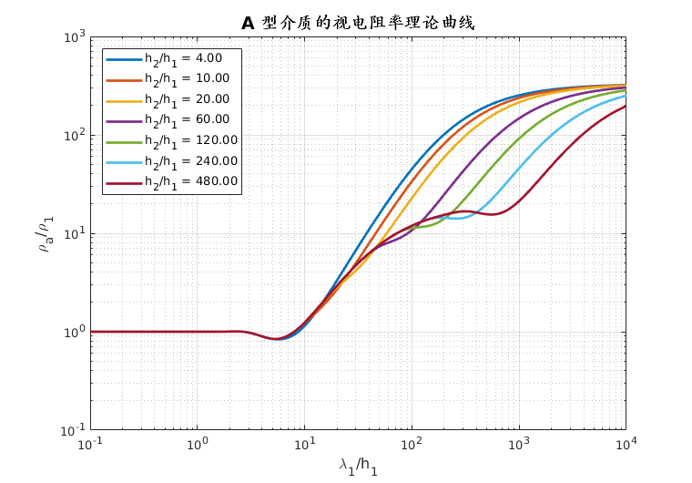

- H 型地层：

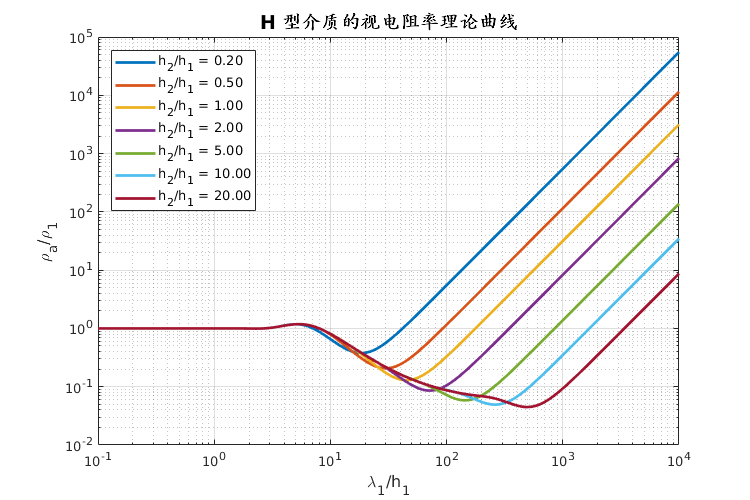

- K 型地层：

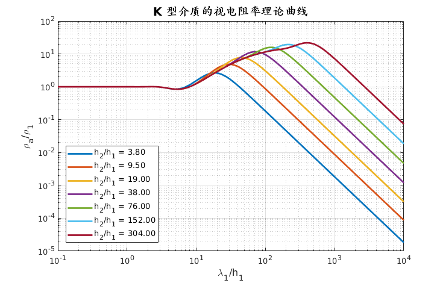

- Q 型地层：

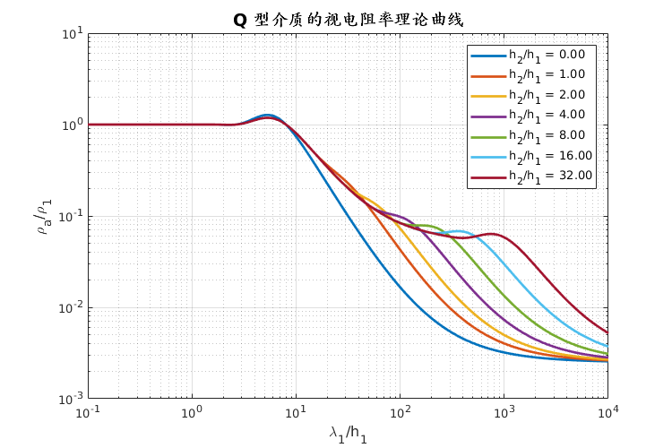

### 可控源音频大地电磁测深

- 均匀半空间：

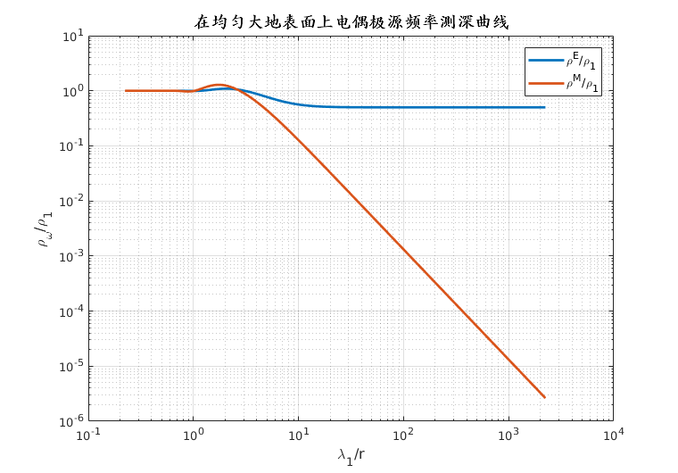

- D 型地层：

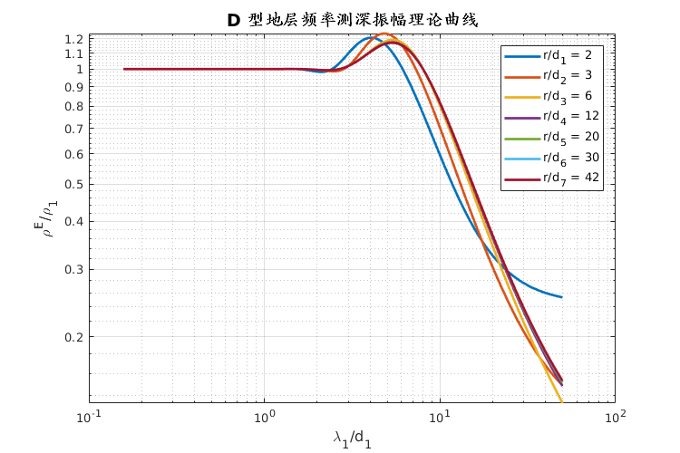
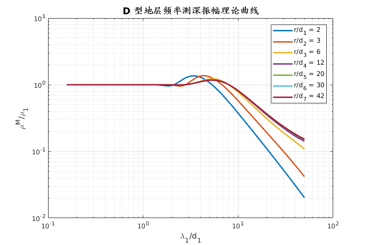
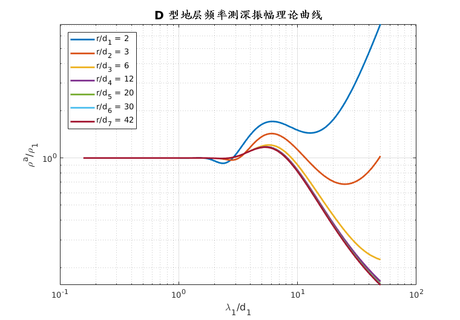

- G 型地层：

- H 型地层：

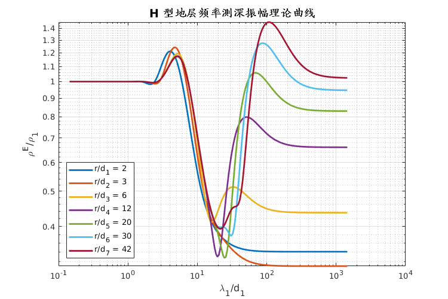
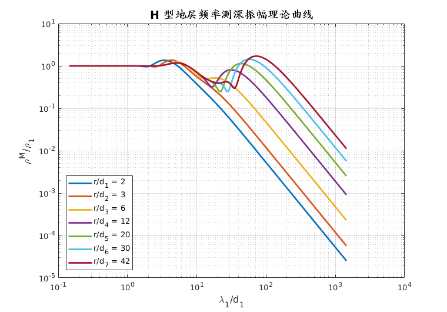
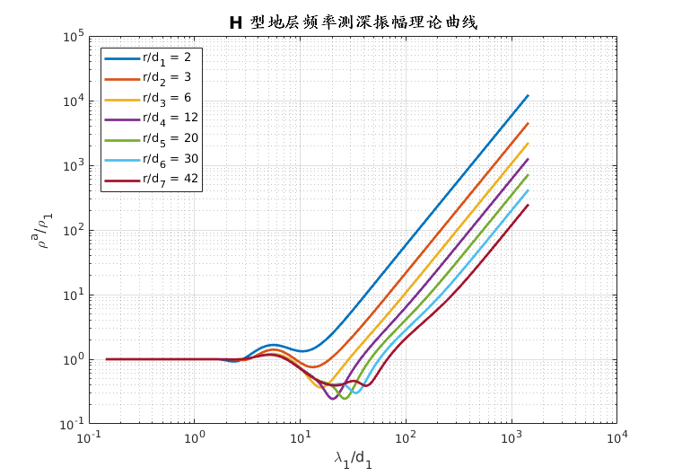

- K 型地层：

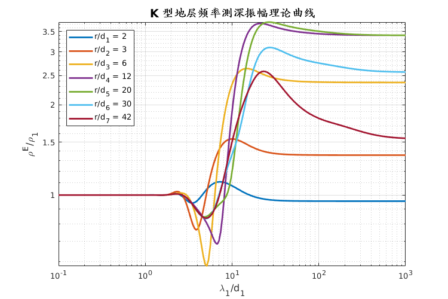
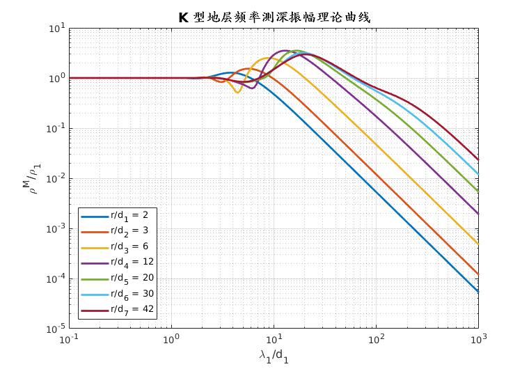
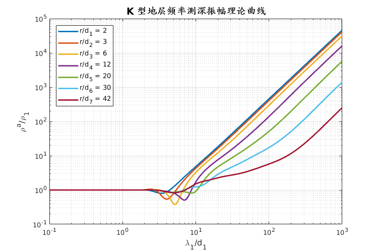

- KH 型地层：

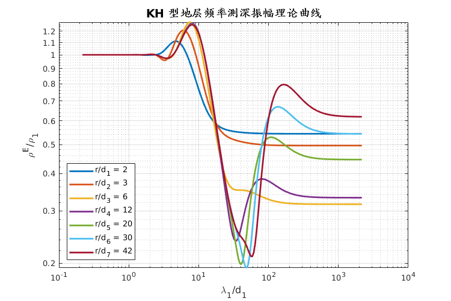

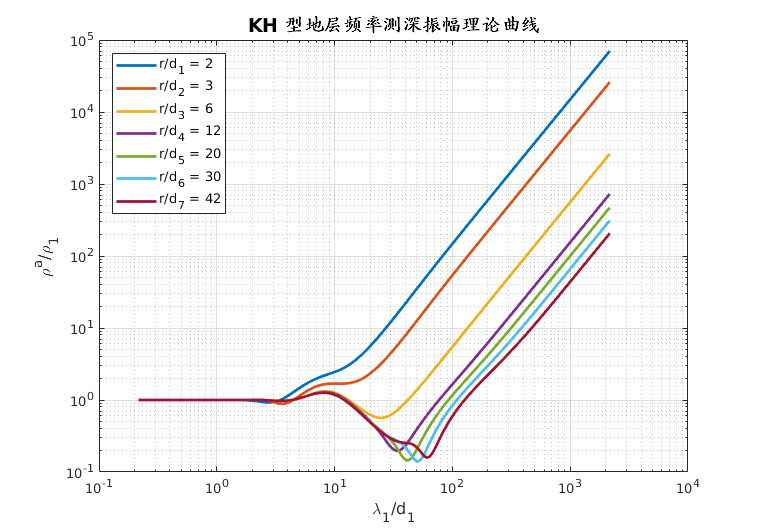

## 参考文献

- 朱仁学，2003. **大地电磁测深法**[M].
- 付海涛，罗维斌，丁志军，余其林，张世宽，2019. **水平电偶极源层状模型垂直磁场全区视电阻率计算方法**[J]. 物探与化探, 43(6), 1309-1319. http://doi.org/10.11720/wtyht.2019.0325
- 张健，2011. **可控源音频大地电磁法一维正反演研究**[D]. 四川成都：成都理工大学.
- Guptasarma and Singh, 1997. **New digital linear filters for Hankel J_0 and J_1 transforms**. Geophysical Prospecting, 45, 745-762.
